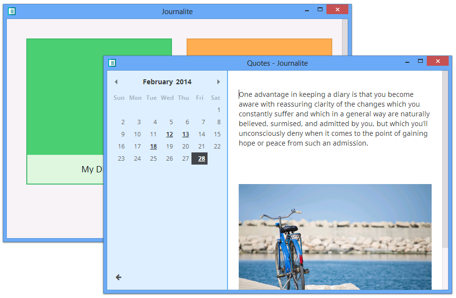

This is a source code for the old Journalite app from 2014.
**Archived and unsupported.**

Released under the MIT license, so if you want to continue developing it,
feel free to fork this repo. **However please don't use the "Journalite" name**
(but you can use the original artwork and icons.)

Tech
----

It's written in Angular.js which runs on top of node-webkit,
so it's cross-platform and ran on Windows, Linux, and macOS.

Updater uses DSA signatures, but obviously, I removed the original private key,
Generate it yourself (as sign/update_dsa_priv.pem, sign/update_dsa_pub.pem)
and don't forget to update app/package.json.

Building
--------

I don't remember how to build it. Check Gruntfile.

